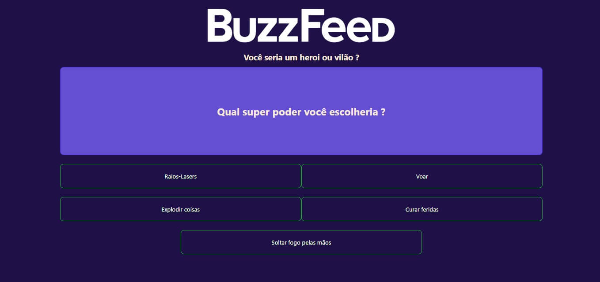

# <h1 align="center">BuzzFeed</h1>

## Descrição do Projeto:

Esse projeto foi desenvolvimento para fazer um clone do <a href="https://www.buzzfeed.com/quizzes">BuzzFeed</a> para aumentar os meus conhecimentos no desenvolvimento usando <a href="https://angular.io/">Angular.</a> Juntamente com o <a href="https://www.typescriptlang.org/">TypeScript</a> para deixar o conteudo da página dinamico e treinar a minha logica de programação.

## Project Description:

This project was developed to make a clone of <a href="https://www.buzzfeed.com/quizzes">BuzzFeed</a> to increase my knowledge in development using <a href="https://angular .io/">Angular.</a> Along with <a href="https://www.typescriptlang.org/">TypeScript</a> to make the page content dynamic and train my programming logic.

<h2 align="center">

</h2>

<h3 align="center">
  
</h3>

### 🛠 Tecnologias / Technologies

As seguintes ferramentas foram usadas na construção do projeto / The following tools were used in building the project:

- [HTML](https://www.w3schools.com/html/)
- [CSS](https://www.w3schools.com/Css/)
- [TypeScript](https://www.typescriptlang.org/)
- [Angular](https://angular.io/)

<h2>:hammer: Créditos</h2>

Web Page feito por / Web Page made by:

<a href="https://github.com/gustavo-freita">Gustavo Freitas</a> <a href="https://github.com/gustavo-freita">
